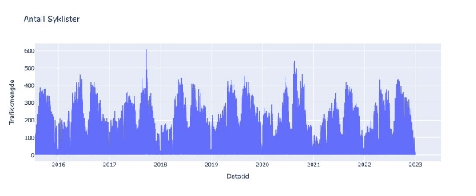
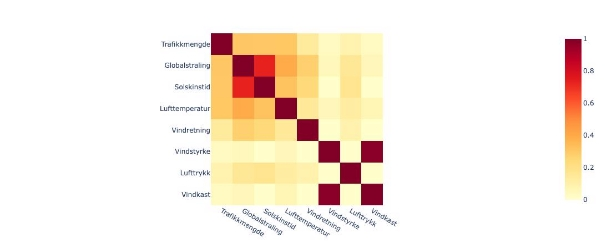
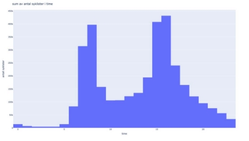
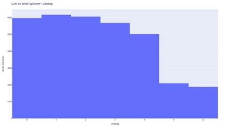
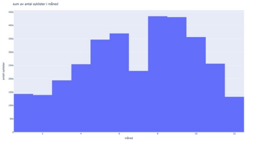
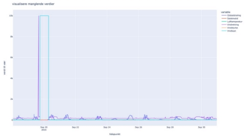
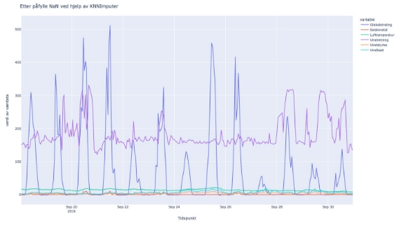
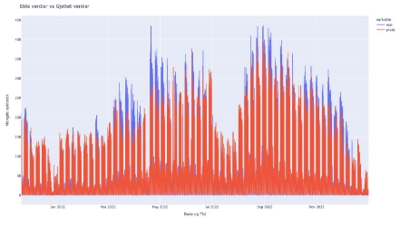

# Data Science Prosjekt

**av Njål Pedersen**

## Innledning

I dette prosjektet er målet å predikere antall syklister som vil sykle totalt over Nygårdsbroen iløpet av en times tid gitt en dato, en tid og værdata. I denne rapporten vil jeg presentere tilnærmingen, designvalgene, resultatene og diskutere implikasjonene.

## Tilnærming / Framgangsmåte til Dataanalyse

### Trafikkdata

Først å bemerke seg er at trafikkdataen er fra Juli 2015 til og med 1. Juli 2023. Viktige variabler jeg tar med meg fra trafikkdataen blir:

1. dato
2. tidspunkt
3. Felt (når lik totalt)
4. Trafikkmengde

Jeg lager et plot av trafikkmengde med hensyn til dato/tidspunkt som X-akse og trafikkmengde på Y-aksen, som resulterte i dette:

Da så jeg med en gang en ‘uteligger’ / en verdi som ikke passet inn i datasettet. Det var 21. september 2017. Jeg fant ut at det var sykkel-VM i Bergen som har vart i en hel uke. Så jeg valgte å kopiere uken før og lime den inn i sykkel-VM uken. Sånn at en senere maskinlæringsmodell ikke vil bli forvirret av den dataen. Fant også et duplikat som jeg fjernet. Etter det fant jeg alle NaN (Not a Number) verdier i ‘trafikkmengde’ feltet og fjernet alle de radene, grunnet at jeg ikke kan imputere noe jeg ønsker å predikere i fremtiden. Dermed ble også alle radene med 2023 verdier borte.

### Værdata

Værdataen er utgitt fra 2010 og opp til juli 2023. Så den dekker alle områder for trafikkdataen. Værdataen er splittet inn i 10 minutters intervaller, mens trafikkdataen er splittet i times intervaller. Løsningen min her ble å samle alle 10 minutters intervaller til dems respekterende timer.

I det jeg slår sammen kolonnene, vil kolonnenes verdier bli sammenslått til gjennomsnittet i løpet av den timen. Det vil si at fordi «NaN» verdier i værdatasettet er 9999.99 vil disse dra opp gjennomsnittene i kolonnene veldig mye. Derfor lagde jeg terskler, som passer på hvilke timer som vil inneholde NaN verdier, disse tersklene ser sånn her ut:

Gjør om alle kolonnen som har disse verdiene:
- Globalstråling > 1000
- Lufttemperatur > 80
- Lufttrykk > 1050
- Solskinstid > 11
- Vindkast > 40
- Vindretning > 366
- Vindstyrke > 40

Til NaN, slik at jeg kan imputere dem senere.

### Sammenslåing av data

Kjørte en `merge` og merget værdatasettet med trafikkdatasettet basert på dato og tid. Lurte litt på om det er noen lineære sammenhenger mellom værdata variabler og trafikkmengden. For eksempel øker temperatur lineært med trafikkmengde? Øker solskinnstid lineært med trafikkmengde?

Derfor lagde jeg en korrelasjonsmatrise som viser lineære sammenhenger, seendes sånn her ut:

Av denne matrisen fant jeg ut at det er minimale lineære sammenhenger mellom trafikkmengde og ‘Globalstråling, Solskinstid og Lufttemperatur’. Resterende variabler har nok ingen sammenheng.

## Håndtering av manglende data & variabelutvinning

Jeg antar at mye av det som er viktig for modellen er tid, med tid mener jeg:

- Hvilken time det er snakk om (lite på natt, flere på dagen etc)
- Hvilken ukedag det er (flere på mandag, tirsdag, ..., fredag enn lørdag og søndag)
- Hvilken måned vi er i (mindre på vinteren, flere på varmere tider.. etc)

For å få et lite innblikk så plotter jeg summen av trafikkmengden i de gitte kategoriene:

**Time:**

**Ukedag:**

**Måned:**

Det som er interessant ut ifra de figurene her er at det var ganske som forventet. På timesmodellen ser vi at flesteparten sykler på dag/kveld tid, spesielt i perioden til og fra jobb (07-08) , (15-16).

På ukedagmodellen ser vi at de aller fleste sykler på ukedager, så pendlere, til fra jobb. På månedsmodellen ser vi at det er få i måned desember, januar og februar. Også ser vi at juli er det mindre syklister. Det er nok grunnet fellesferie.

Andre variabler som jeg har prøvd å legge til:
- Hvilken dag i måneden det er
- Om det er ferie eller ikke

Ferie og dag variabler viste seg å gi et mye bedre resultat under trening av en modell. Så disse inkluderte jeg i datasettet.

## Imputering av manglende / NaN verdier

Tenkte ut flere løsninger jeg kunne håndtere disse manglende verdiene:
- Jeg prøvde «Forward fill» og «backward fill»
- Jeg prøvde å fjerne alle radene med NaN
- Jeg har prøvd KNN Imputing – K Nearest Neighbour imputering.
- Jeg har prøvd SimpleImputer
- Jeg har prøvd IterativeImputer

Før imputasjon (eksempel):

Etter imputasjon (samme tidsepoke som over):

## Trening-Test-Valideringsdata

Først må jeg splitte data inn i treningsdata, testdata og valideringsdata. Dataen deler jeg inn i kronologisk rekkefølge med en 70-15-15 split. Så trener jeg imputeringsmodellen på treningsdataen. Og sjekker presentasjonen med hensyn til valideringsdata. Deretter tester jeg generalisering på en 85-15 split, slik at jeg får trent på 85% av den første dataen og deretter testet på siste 15 utestet data.

Prøvd KNN Imputing (som ga best resultat) på treningsdata med masse forskjellig n\_neighbours parametere, fant ut at n\_neighbours = 4 er best for imputering av treningsdata.

Imputering viste seg å være best med kolonnene:
1. 'Globalstråling'
2. 'Solskinstid'
3. 'Lufttemperatur'
4. 'Vindretning'
5. 'Vindstyrke'
6. 'Lufttrykk'
7. 'Vindkast'
8. 'ferie'
9. 'time'
10. 'måned'
11. 'year'
12. 'day'

Trening av modellen viste seg å være best med disse kolonnene:
1. 'Globalstråling'
2. 'Solskinstid'
3. 'Lufttemperatur'
4. 'Vindretning'
5. 'Vindstyrke'
6. 'Vindkast'
7. 'time'
8. 'ukedag'
9. 'måned'
10. 'ferie'
11. 'day'

## Maskinlæringsmodelltilpasninger

Kjørte først en enkel Grunnlinje-Modell:
RMSE for Grunnlinjemodell på valideringsdata: 67.09

Da har jeg et fint utgangspunkt.

Trente 3 fundamentalt forskjellige modeller som jeg vil teste:
- Random Forest Regression
- Support Vector Regression
- MultiLayer perceptron NN

RMSE Random Forest Regressor på valideringsdata: 23.61
RMSE Support Vector Regression på valideringsdata: 63.3
RMSE MultiLayer perceptron NN på valideringsdata: 49.6

Random Forest Regressor skiller seg veldig ut. Lagde et python dict med veldig mange modeller og forskjellige hyperparametere bl.a:
- Random Forest Regression
- Support Vector Regression
- MultiLayer perceptron NN
- Decision Tree Regressor
- Gradient Booster Regressor
- Ada Boost Regressor
- Lasso

Skrev deretter alle resultater i en csv fil som ble seendes sånn her ut:

| models | rmse_val | rmse_test |
|--------|----------|-----------|
| GradientBoosterRegressor winner | 21.502466 | 19.451734 |
| Random forest regresser {parametre} | 22.877227 | 23.134666 |
| Decision Tree Regressor {parametre} | 26.777272 | 26.728870 |
| Ada Boost Regressor {parametre} | 44.779032 | 46.715319 |
| MultiLayer Perceptron Model {parametre} | 48.631832 | 44.722532 |

Totalt testet jeg 6 modeller med unike parametere totalt tilsvarende 4811 unike modeller.

## Resultater

Modellen som var best ‘GradientBoosterRegressor winner’ er GradientBoosterRegressor med disse parameterene:
- Loss = 'squared_error'
- Learning_rate = 0.03
- n_estimators = 140
- subsample = 0.6
- max_depth = 9
- alpha = 0.4
- criterion = 'squared_error'
- min_samples_split = 10
- min_samples_leaf = 3
- tol = 0.0001
- random_state = 10 # for reproduksjon og sammenligning

### Modellprestasjon

Denne modellen får en RMSE på valideringsdata på 21.50 og får en RMSE på sammenslått trening og valideringsdata (generaliseringsevne) lik 19.26. Denne presentasjonen er jeg veldig fornøyd med.

Dette er plot på ekte test data vs predikert test data:

### Predikere 2023

Merger 2023 værdatasammen med 2023 trafikkdata som tidligere. 2023 trafikkdata mangler en linje kl. 02:00 26 mars. Derfor blir ikke prediksjon for denne inkludert.

Dermed blir dataen predikert og lagrer prediksjonen i en ‘predictions.csv’ fil.

### Overraskende Resultater

Ble overrasket over hvor stort sprik det var mellom resultatene til de forskjellige modellene. Er nok noen modeller som SVC og Multilayer Perceptron som trenger mye mer data for å prestere, mens tre-modeller klarer seg fint på den mengden med data vi allerede har.

### Tilfredsstillende Resultater

Veldig tilfredsstillende resultater på GradientBoosterRegressor med litt parameter endring. Ga veldig lav RMSE. Ble også veldig overrasket over hvor bra KNN-imputer var. Presterte kjempebra i motsetning til alt det andre jeg prøvde.

### Potensial for Forbedring

Hvis jeg hadde hatt ubegrenset tid ville jeg kanskje manuelt fylt inn en kolonne med dager som ikke er røde og dermed ikke registreres av holidays-pakken, men samtidig er dager som er inneklemte, eller fellesferier som ikke er røde.

### Modellens Ytelse

Modellen yter ganske bra og gir reelle prediksjoner i forhold til reelle trafikkmengde resultater.

### Nettside

For å kjøre nettsiden må du først ha kjørt «prosjekt.py» i samme mappe hvor serveren er i en separat mappe som heter ‘server’. Dermed må du cd til serveren. Og kjøre «python app.py» eller «python3 app.py». Dermed vil serveren bli hostet på http://localhost:8080

#### Hjemmeside

Trykk her:

Velg dato:

Velg tidspunkt:

Velg hvor mye sol:

Velg temperatur:

Resultat:

